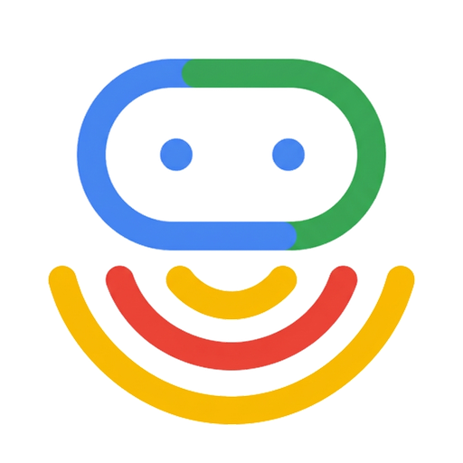

<div align="center">



<h1>ADK Sonar</h1>
<h3>A live voice agent for work in motion.</h3>

</div>

---

An [ADK](https://google.github.io/adk-docs/) reference implementation demonstrating how to build a **low-latency Gemini Live voice orchestrator** that stays conversationally responsive while dispatching long-running background coding agents in isolated cloud sandboxes, managing daily productivity across Google Workspace, GitHub, Spotify, Maps, Search, and Slack, and rendering live visual surfaces to a mobile-first control plane.

> [!NOTE]
> **This is an educational recipe, not a packaged library.** It demonstrates how to combine bidirectional audio streaming (`run_live`), non-blocking background tool scheduling (`WHEN_IDLE`), interchangeable coding agent harnesses (`horizon`, `antigravity`, `claude`) inside a shared Vertex AI Agent Engine Sandbox, and scoped [A2UI v0.9](https://github.com/google/A2UI) visual cards. You are not meant to `pip install` it — you are meant to read how the pieces fit together and lift the patterns you need into your own agent.
>
> - **Study the components** → [`AGENTS.md`](AGENTS.md) maps every interface to the file and function that implements it
> - **Run it yourself** → [Quickstart](#quickstart) gets the full local voice + sandbox stack running in ~5 minutes
> - **Build your own** → [Use a coding agent](#build-your-own-with-a-coding-agent) to adapt these patterns to your own domain
> - **Deploy** → [Deploy](#deploy) ships the FastAPI WebSocket backend + React PWA to Cloud Run

<div align="center">

<!-- TODO: Replace with demo video / GIF once recorded -->
> 🎬 **Demo Video Coming Soon** — *Live voice orchestration across Google Workspace, GitHub, Spotify, and multi-agent coding sandboxes from mobile.*

</div>

---

## Features

**Live Voice & Non-Blocking Orchestration**
- **Sub-second bidirectional voice (`run_live`)** — Continuous PCM 16kHz/24kHz audio streaming and barge-in over WebSockets (`app/main.py`), powered by `gemini-live-2.5-flash-native-audio` on Vertex AI (`us-central1`). This means the voice persona never pauses awkwardly mid-sentence waiting for a tool call to return — audio remains fluid and human-feeling throughout every interaction.
- **Non-blocking background tool dispatch (`WHEN_IDLE`)** — Every tool (`app/tools/async_wrapper.py`) immediately yields `{status: "RUNNING"}` to the Gemini Live stream so the voice persona (`Charon`) acknowledges the request in natural conversation without stalling audio frames, then narrates completion once the background coroutine finishes. This design pattern is the core architectural insight of ADK Sonar: long-running operations (cloning a repo, running tests, deploying to Cloud Run) never block the voice turn.
- **Voice-first conciseness guardrails** — System instruction (`app/agent.py`) enforces 1–2 spoken sentences per turn while offloading code diffs, PR lists, and schedules to the visual stage. This keeps conversations feeling natural and avoids the "wall of text" problem common in AI assistants that read out long structured data aloud.

**Shared Cloud Sandbox & Interchangeable Coding Harnesses**
- **Persistent Vertex AI Agent Engine Sandbox** — All background coding tasks run inside a live remote Linux container (`app/workers/sandbox.py`) provisioned on Vertex AI Agent Engine (`us-central1`) with automated local fallback and one-command re-provisioning (`make sandbox`). The sandbox persists between sessions, so cloned repositories, installed dependencies, and in-progress worktrees survive restarts without re-setup overhead.
- **Git worktree isolation per task** — Each coding task executes in its own isolated git worktree (`workspaces/<repo>/.worktrees/<task_id>`) on branch `task/<task_id>`, preventing concurrent agents from stepping on each other's working trees. This allows you to run three simultaneous coding tasks on the same repo without any merge conflicts or file-system collisions between agents.
- **Two-phase Plan → Execute with human gate** — In `plan` mode, the coding harness analyzes the repo and writes `PLAN.md` without mutating code, rendering a live **Plan Approval Gate** in the UI (`Approve & Execute` / `Request Changes` / `Switch Harness`). This gate exists so you always have a chance to review and redirect the agent's approach before any code is written — eliminating the "surprised by what it did" problem common with fully autonomous coding agents.
- **Mid-task harness switching** — Seamlessly hand off an active task (`POST /api/v1/tasks/{id}/switch-harness`) between **ADK Long-Horizon** (`horizon`), **Antigravity CLI** (`antigravity`), and **Claude Code** (`claude`). Because `PLAN.md`, `PROGRESS.md`, and git commits live inside the shared sandbox worktree, the incoming harness picks up right where the previous one left off. This is particularly useful when one harness reaches its context limit or is better suited to a specific phase of the task.

**Scoped A2UI v0.9 Stage & Mobile Control Plane**
- **Single-surface visual stage** — Instead of scrolling chat transcripts, the UI (`web/src/components/a2ui/A2UISurfaceDeck.tsx`) renders a focused **A2UI v0.9** surface card (`TaskStatusCard`, `PlanReviewCard`, `GitHubPRCard`, `WorkspaceDigestCard`, `CalendarAgendaCard`, `SpotifyPlayerCard`, `PlaceCard`) synchronized with live voice turns. Each card is purpose-built for its domain — the `PlanReviewCard` renders diff-style plan previews with approve/reject controls, while the `SpotifyPlayerCard` shows album art and playback controls directly.
- **Interactive bottom sheets** — Dedicated slide-up drawers for **Tasks** (live terminal diffs, `PLAN.md` inspection, harness switching), **Workspaces** (clone repos, inspect branches, auto-discover personal GitHub forks), **Connected Apps** (1-click OAuth & CLI auth detection), and **Transcript & Text Input**. Each drawer can be opened independently via its icon in the bottom navigation bar, keeping the main stage uncluttered during active voice sessions.

**Zero-Friction OAuth & Live Integrations**
- **Unified OAuth 2.0 + Refresh Token lifecycle (`app/auth.py`)** — Built-in PKCE + refresh token auto-rotation for **Spotify** and **Google Workspace** (Calendar, Gmail, Drive), 1-click `gcloud` / `gh` CLI detection, dynamic personal fork discovery (`GET /user` → `<owner>/<repo>`), and automatic **Slack** workspace discovery (`auth.test`). The auth manager handles token expiry and silent refresh in the background so integrations never drop mid-conversation because a token expired.

---

## The stack

Built on [Google ADK](https://google.github.io/adk-docs/), [Gemini Live API](https://cloud.google.com/vertex-ai/generative-ai/docs/model-reference/multimodal-live), and [Vertex AI Agent Engine Sandboxes](https://cloud.google.com/vertex-ai/generative-ai/docs/agent-engine/overview):

| Capability | What provides it |
|---|---|
| Bidirectional voice & barge-in | ADK `Runner.run_live()` + `LiveRequestQueue` (`gemini-live-2.5-flash-native-audio`) — streams PCM audio in real time and supports mid-sentence interruption so the conversation never feels robotic |
| Non-blocking tool execution | Custom `@non_blocking_tool` decorator (`app/tools/async_wrapper.py`) — immediately returns `{status: "RUNNING"}` to keep audio frames flowing while the real work completes in the background |
| Remote code execution | Vertex AI Agent Engine `sandboxEnvironments` (`app/workers/sandbox.py`) — a persistent remote Linux container with full shell access, pre-installed toolchains, and automatic local fallback when offline |
| Multi-harness worker execution | `CodingHarness` protocol (`app/workers/harnesses.py`) with `HorizonHarness`, `AntigravityHarness`, and `ClaudeCodeHarness` — a shared interface that lets you swap AI coding engines mid-task without losing worktree state or git history |
| Generative UI cards | Custom **A2UI v0.9** event emitter (`app/callbacks/a2ui_emitter.py`) + React surface deck — maps each tool result to a purpose-built visual card so information is shown, not read aloud |
| Connected app authentication | Declarative `config/integrations.yaml` + OAuth 2.0 / ADC manager (`app/auth.py`) — a single config file defines every integration; the auth manager handles PKCE, refresh tokens, and CLI credential detection automatically |

Everything else is custom glue (~2,800 lines across `app/` and `web/`), built on six core interfaces:

1. **Non-blocking Live Voice tool wrapper** — `app/tools/async_wrapper.py` (`non_blocking_tool`) — the decorator that makes every tool voice-safe by decoupling acknowledgement from completion
2. **Pluggable Multi-Harness Sandbox protocol** — `app/workers/harnesses.py` (`CodingHarness`) + `app/workers/sandbox.py` (`SandboxProvisioner`) — the abstraction layer that lets `horizon`, `antigravity`, and `claude` share one sandbox and one set of worktrees
3. **Two-phase Plan → Execute & worktree handoff** — `app/workers/task_worker.py` (`TaskWorker.dispatch_task`, `switch_harness`) — ensures a human always reviews a plan before code is written, and preserves all state when switching harnesses
4. **Scoped A2UI v0.9 surface deck emitter** — `app/callbacks/a2ui_emitter.py` (`emit_surface_for_tool`) — routes each tool's output to the correct visual card type so the UI stays contextual and scannable
5. **Declarative OAuth 2.0 + ADC Workspace bridge** — `app/auth.py` (`IntegrationAuthManager`) — centralises all credential lifecycle logic so adding a new integration is a single entry in `config/integrations.yaml`
6. **Human + AI-Agent dual-mode onboarding** — `scripts/provision_sandbox.py` (`--non-interactive`) — the same script runs interactively for humans and headlessly for CI pipelines or agent-driven environment setup

See [`AGENTS.md`](AGENTS.md) for the complete architecture map, start-here file table, and troubleshooting reference.

---

## Quickstart

### Prerequisites
- **Python 3.11+** with [`uv`](https://docs.astral.sh/uv/) installed
- **Node.js 20+** and `npm`
- **Google Cloud SDK (`gcloud`)** authenticated against a GCP project with **Vertex AI API** enabled (`gcloud auth login`)
- *(Optional)* **GitHub CLI (`gh`)** logged in (`gh auth login`) to automatically clone your personal forks into the sandbox

### 1. Clone & run interactive onboarding (5 minutes)

The onboarding wizard (`make onboard`) walks you step-by-step through the full environment setup. It configures your GCP project, provisions your live **Vertex AI Agent Engine Sandbox** (the persistent remote Linux container where all coding tasks execute), clones your personal GitHub forks into `/workspaces` so agents can immediately operate on your real repositories, and guides you through connecting **Google Workspace, Google Search, Google Maps, GitHub, Spotify, and Slack** — press `Enter` to skip any integration and toggle it later from the mobile UI. The whole process typically completes in under five minutes and stores all credentials safely in your local `.env` file.

```bash
git clone https://github.com/allen-stephen/adk-sonar.git
cd adk-sonar
make onboard
```

### 2. Verify live connections

Run the health check suite at any time to verify that your Vertex AI credentials are valid, your remote sandbox container is reachable and responding, and every connected app's OAuth tokens are fresh. This is the fastest way to diagnose why a particular integration isn't working — each check prints a clear pass/fail status with a one-line explanation of what to do if it fails.

```bash
make check
```

### 3. Start the voice orchestrator

Launches both the FastAPI WebSocket backend (port 8000) and the Vite-compiled React PWA (port 5173) in a single terminal with hot-reload enabled on both. The backend connects immediately to your Vertex AI Agent Engine Sandbox and initialises all configured integrations, so by the time the UI opens in your browser the full voice stack is live.

```bash
make dev
```

- **Mobile / Web UI**: [http://127.0.0.1:5173](http://127.0.0.1:5173)
- **FastAPI + WebSocket Backend**: [http://127.0.0.1:8000](http://127.0.0.1:8000)

Tap the center **Mic button** to start a live voice session, or open **Connected Apps** (plug icon in the top header) to toggle integrations with 1-click OAuth.

---

## Build your own with a coding agent

This repo includes an [`AGENTS.md`](AGENTS.md) designed to be read by both humans and coding agents (Claude Code, Gemini CLI, Antigravity, Cursor). Point your coding agent at this repo and ask it to lift the patterns you need:

```bash
git clone https://github.com/allen-stephen/adk-sonar.git
cd adk-sonar
# Launch your coding agent (claude, gemini, etc.)
```

**Example prompts:**
- *"Read AGENTS.md. I want to build a voice-controlled DevOps incident responder that uses the `@non_blocking_tool` wrapper and A2UI surface cards for PagerDuty and Cloud Logging."*
- *"Read AGENTS.md and show me how `TaskWorker.switch_harness` preserves `PLAN.md` and git worktree state when switching between `horizon` and `claude`."*
- *"Run `uv run python scripts/provision_sandbox.py --non-interactive --check-only` to inspect my current environment, then add a new Linear integration to `config/integrations.yaml` and `app/tools/integration_tools.py`."*

---

## Learn & adapt

| If you want to understand... | Read this file |
|---|---|
| How the Gemini Live voice persona and 13 tools are wired | [`app/agent.py`](app/agent.py) (`root_agent`, `SYSTEM_INSTRUCTION`) — defines the voice persona name, tone guardrails, and the full tool list registered with the live runner |
| How tools return `{status: "RUNNING"}` immediately without stalling voice audio | [`app/tools/async_wrapper.py`](app/tools/async_wrapper.py) (`non_blocking_tool`) — a single decorator that wraps any async function into a voice-safe, non-blocking tool |
| How background coding tasks run inside Vertex AI Agent Engine Sandboxes | [`app/workers/sandbox.py`](app/workers/sandbox.py) (`SandboxProvisioner`) — handles sandbox creation, health-check polling, shell command execution, and graceful local fallback |
| How `horizon`, `antigravity`, and `claude` share worktrees and `PLAN.md` | [`app/workers/harnesses.py`](app/workers/harnesses.py) & [`app/workers/task_worker.py`](app/workers/task_worker.py) — the `CodingHarness` protocol and the `switch_harness` method that transfers state between engines |
| How tool results map to scoped A2UI v0.9 visual cards | [`app/callbacks/a2ui_emitter.py`](app/callbacks/a2ui_emitter.py) & [`web/src/components/a2ui/A2UISurfaceDeck.tsx`](web/src/components/a2ui/A2UISurfaceDeck.tsx) — the emitter maps tool names to card types; the deck renders and animates card transitions |
| How OAuth 2.0 PKCE, refresh tokens, and `gcloud` ADC scopes work | [`app/auth.py`](app/auth.py) (`IntegrationAuthManager`) — manages the full credential lifecycle for every integration, including silent token refresh and CLI credential detection |

For the full file map, maintenance rules, and troubleshooting guide (`X-Goog-User-Project` headers, Spotify `127.0.0.1` loopback, Sandbox `502` eviction recovery), read **[`AGENTS.md`](AGENTS.md)**.

---

## Deploy

Deploy the full-stack application (compiled React PWA + FastAPI WebSocket server) to **Google Cloud Run** and sync your local `.env` secrets in two commands. The deploy target compiles the React UI into a production bundle, packages it alongside the FastAPI server into a Docker container, pushes the image to Google Artifact Registry, and rolls out a new Cloud Run revision — all in one step. The sync-secrets target reads every key from your local `.env` file and writes it to the Cloud Run service's environment so your OAuth tokens, API keys, and GCP credentials are available to the live deployment without committing secrets to the repository.

```bash
# 1. Build and deploy container to Cloud Run (us-central1)
make deploy

# 2. Push your local .env integration tokens & APP_URL to the live Cloud Run service
make sync-secrets
```

> [!TIP]
> After deploying to Cloud Run, add `https://<your-cloud-run-url>/api/v1/auth/<integration_id>/callback` to your Spotify Developer Dashboard and Google Cloud Console OAuth 2.0 Redirect URIs so 1-click OAuth works on your mobile device anywhere.

---

## Quick Reference Commands

The table below is a complete developer cheat-sheet for every routine `make` target. All commands should be run from the repository root after completing `make onboard`.

| Command | Purpose |
|---|---|
| `make onboard` | Runs the interactive 5-minute setup wizard: configures your GCP project, provisions the Vertex AI Agent Engine Sandbox, clones your GitHub forks into `/workspaces`, and walks through OAuth setup for all integrations. Run this once after cloning the repo. |
| `make check` | Executes a non-interactive suite of environment and integration health checks — validates Vertex AI credentials, confirms sandbox reachability, and verifies that every connected app's OAuth tokens are fresh. Run this any time an integration stops responding. |
| `make dev` | Starts both the FastAPI WebSocket backend (port 8000) and the Vite React PWA (port 5173) concurrently in a single terminal with hot-reload enabled on both sides. This is the primary command for local development and voice testing. |
| `make test` | Runs the full unit and integration test suite via `pytest`, covering tool wrappers, harness protocols, auth flows, and A2UI emitter logic. Always run this before opening a pull request. |
| `make eval` | Executes the ADK Live evaluation suites against a live sandbox, replaying scripted voice turns and asserting that tool calls, card emissions, and voice responses match expected golden outputs. Use this to catch regressions in the voice persona or tool routing before deploying. |
| `make deploy` | Compiles the React PWA into a production bundle, packages it with the FastAPI server into a Docker container, pushes the image to Google Artifact Registry, and rolls out a new revision to Cloud Run (us-central1). Requires `gcloud` to be authenticated. |
| `make sync-secrets` | Reads every key from your local `.env` file and writes it as environment variables to the live Cloud Run service — safely propagating OAuth tokens, API keys, and `APP_URL` to production without committing secrets to the repository. |
| `make sandbox` | Re-provisions (or repairs) the Vertex AI Agent Engine Sandbox. Run this if `make check` reports a sandbox `502` or eviction error, or after changing sandbox resource configuration in `config/sandbox.yaml`. |

---

## Disclaimer

This repository is for demonstrative and educational purposes only. It is not an officially supported Google product.
