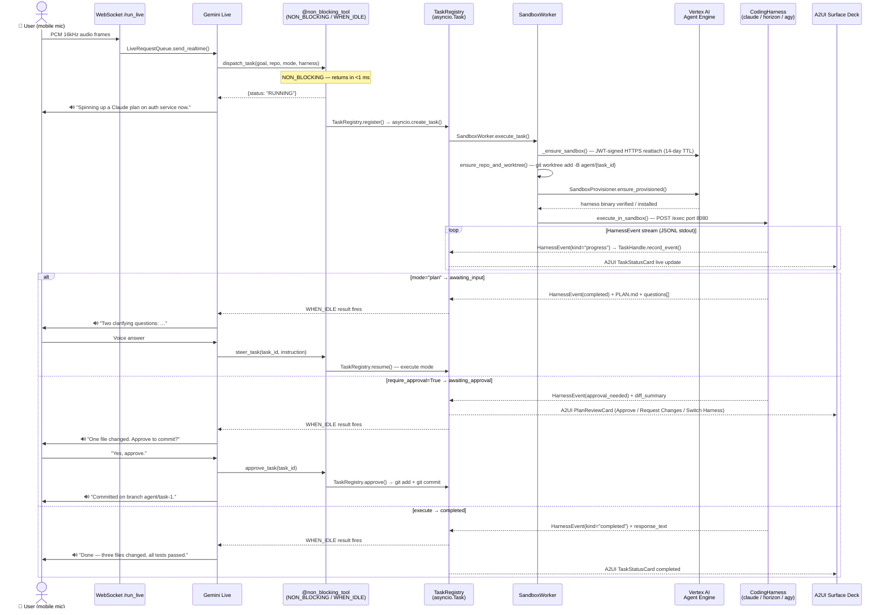

<div align="center">


<h1>ADK Sonar</h1>
<h3>A live voice agent for work in motion.</h3>

</div>

---

An [ADK](https://google.github.io/adk-docs/) reference implementation demonstrating how to build a **low-latency Gemini Live voice orchestrator** that stays conversationally responsive while dispatching long-running background coding agents in isolated cloud sandboxes, managing daily productivity across Google Workspace, GitHub, Spotify, Maps, Search, and Slack, and rendering live visual surfaces to a mobile-first control plane.

> [!NOTE]
> **This is an educational recipe, not a packaged library.** It demonstrates how to combine bidirectional audio streaming (`run_live`), non-blocking background tool scheduling (`WHEN_IDLE`), interchangeable coding agent harnesses (`horizon`, `antigravity`, `claude`) inside a shared Vertex AI Agent Engine Sandbox, and scoped [A2UI v0.9](https://github.com/google/A2UI) visual cards. You are not meant to `pip install` it — you are meant to read how the pieces fit together and lift the patterns you need into your own agent.
>
> - **Study the components** → [`AGENTS.md`](AGENTS.md) maps every interface to the file and function that implements it
> - **Run it yourself** → [Quickstart](#quickstart) gets the full local voice + sandbox stack running in ~5 minutes
> - **Build your own** → [Use a coding agent](#build-your-own-with-a-coding-agent) to adapt these patterns to your own domain
> - **Deploy** → [Deploy](#deploy) ships the FastAPI WebSocket backend + React PWA to Cloud Run

---

## Features

**Live Voice & Non-Blocking Orchestration**
- **Sub-second bidirectional voice (`run_live`)** — Continuous PCM 16kHz/24kHz audio streaming and barge-in over WebSockets (`app/main.py`), powered by `gemini-live-2.5-flash-native-audio` on Vertex AI (`us-central1`).
- **Non-blocking background tool dispatch (`WHEN_IDLE`)** — Every tool (`app/tools/async_wrapper.py`) immediately yields `{status: "RUNNING"}` to the Gemini Live stream so the voice persona (`Charon`) acknowledges the request in natural conversation without stalling audio frames, then narrates completion once the background coroutine finishes.
- **Voice-first conciseness guardrails** — System instruction (`app/agent.py`) enforces 1–2 spoken sentences per turn while offloading code diffs, PR lists, and schedules to the visual stage.

**Shared Cloud Sandbox & Interchangeable Coding Harnesses**
- **Persistent Vertex AI Agent Engine Sandbox** — All background coding tasks run inside a live remote Linux container (`app/workers/sandbox.py`) provisioned on Vertex AI Agent Engine (`us-central1`) with automated local fallback and one-command re-provisioning (`make sandbox`).
- **Git worktree isolation per task** — Each coding task executes in its own isolated git worktree (`workspaces/<repo>/.worktrees/<task_id>`) on branch `task/<task_id>`, preventing concurrent agents from stepping on each other's working trees.
- **Two-phase Plan → Execute with human gate** — In `plan` mode, the coding harness analyzes the repo and writes `PLAN.md` without mutating code, rendering a live **Plan Approval Gate** in the UI (`Approve & Execute` / `Request Changes` / `Switch Harness`).
- **Mid-task harness switching** — Seamlessly hand off an active task (`POST /api/v1/tasks/{id}/switch-harness`) between **ADK Long-Horizon** (`horizon`), **Antigravity CLI** (`antigravity`), and **Claude Code** (`claude`). Because `PLAN.md`, `PROGRESS.md`, and git commits live inside the shared sandbox worktree, the incoming harness picks up right where the previous one left off.

**Scoped A2UI v0.9 Stage & Mobile Control Plane**
- **Single-surface visual stage** — Instead of scrolling chat transcripts, the UI (`web/src/components/a2ui/A2UISurfaceDeck.tsx`) renders a focused **A2UI v0.9** surface card (`TaskStatusCard`, `PlanReviewCard`, `GitHubPRCard`, `WorkspaceDigestCard`, `CalendarAgendaCard`, `SpotifyPlayerCard`, `PlaceCard`) synchronized with live voice turns.
- **Interactive bottom sheets** — Dedicated slide-up drawers for **Tasks** (live terminal diffs, `PLAN.md` inspection, harness switching), **Workspaces** (clone repos, inspect branches, auto-discover personal GitHub forks), **Connected Apps** (1-click OAuth & CLI auth detection), and **Transcript & Text Input**.

**Zero-Friction OAuth & Live Integrations**
- **Unified OAuth 2.0 + Refresh Token lifecycle (`app/auth.py`)** — Built-in PKCE + refresh token auto-rotation for **Spotify** and **Google Workspace** (Calendar, Gmail, Drive), 1-click `gcloud` / `gh` CLI detection, dynamic personal fork discovery (`GET /user` → `<owner>/<repo>`), and automatic **Slack** workspace discovery (`auth.test`).

---

## The stack

Built on [Google ADK](https://google.github.io/adk-docs/), [Gemini Live API](https://cloud.google.com/vertex-ai/generative-ai/docs/model-reference/multimodal-live), and [Vertex AI Agent Engine Sandboxes](https://cloud.google.com/vertex-ai/generative-ai/docs/agent-engine/overview):

| Capability | What provides it |
|---|---|
| Bidirectional voice & barge-in | ADK `Runner.run_live()` + `LiveRequestQueue` (`gemini-live-2.5-flash-native-audio`) |
| Non-blocking tool execution | Custom `@non_blocking_tool` decorator (`app/tools/async_wrapper.py`) emitting `WHEN_IDLE` results |
| Remote code execution | Vertex AI Agent Engine `sandboxEnvironments` (`app/workers/sandbox.py`) |
| Multi-harness worker execution | `CodingHarness` protocol (`app/workers/harnesses.py`) with `HorizonHarness`, `AntigravityHarness`, and `ClaudeCodeHarness` |
| Generative UI cards | Custom **A2UI v0.9** event emitter (`app/callbacks/a2ui_emitter.py`) + React surface deck |
| Connected app authentication | Declarative `config/integrations.yaml` + OAuth 2.0 / ADC manager (`app/auth.py`) |

Everything else is custom glue (~2,800 lines across `app/` and `web/`), built on six core interfaces:

1. **Non-blocking Live Voice tool wrapper** — `app/tools/async_wrapper.py` (`non_blocking_tool`)
2. **Pluggable Multi-Harness Sandbox protocol** — `app/workers/harnesses.py` (`CodingHarness`) + `app/workers/sandbox.py` (`SandboxProvisioner`)
3. **Two-phase Plan → Execute & worktree handoff** — `app/workers/task_worker.py` (`TaskWorker.dispatch_task`, `switch_harness`)
4. **Scoped A2UI v0.9 surface deck emitter** — `app/callbacks/a2ui_emitter.py` (`emit_surface_for_tool`)
5. **Declarative OAuth 2.0 + ADC Workspace bridge** — `app/auth.py` (`IntegrationAuthManager`)
6. **Human + AI-Agent dual-mode onboarding** — `scripts/provision_sandbox.py` (`--non-interactive`)

See [`AGENTS.md`](AGENTS.md) for the complete architecture map, start-here file table, and troubleshooting reference.

---

## How it works — Voice-to-sandbox request lifecycle

The diagram below traces a single voice request (*"Write a plan for the auth service refactor"*) from microphone through Gemini Live, across the non-blocking tool boundary, into the Vertex AI Agent Engine sandbox, and back as spoken narration — without ever stalling the audio stream.



**Five stages, one uninterrupted audio stream:**

1. **Voice → `RUNNING` in <1 ms** — PCM audio frames stream over the WebSocket into `Runner.run_live()`. When Gemini detects a coding intent, it calls `dispatch_task()`—wrapped by `non_blocking_tool()`—which declares `NON_BLOCKING` behavior so the Live API immediately returns `{status: "RUNNING"}` while Gemini speaks a brief acknowledgment *without pausing the audio stream* (`app/agent.py` → `non_blocking_tool`).

2. **Background sandbox dispatch** — `TaskRegistry.register()` creates an `asyncio.Task` that calls `SandboxWorker.execute_task()`. The worker sends a JWT-signed HTTPS request to Vertex AI Agent Engine to reattach to (or provision) a persistent sandbox container with a 14-day TTL, then calls `ensure_repo_and_worktree()` to create an isolated `git worktree add -B agent/{task_id}` branch so concurrent tasks never share a working tree (`app/workers/sandbox.py`, `app/workers/harnesses/base.py`).

3. **Harness preflight + execution** — `SandboxProvisioner.ensure_provisioned()` runs a health probe (`claude --version`, `agy --version`) and installs the harness binary if missing (`npm install -g @anthropic-ai/claude-code@latest`). The selected `CodingHarness` then POSTs the CLI invocation to the sandbox `/exec` endpoint on port 8080, streaming JSONL `HarnessEvent` messages back to `TaskHandle.record_event()`, which feeds live diffs to the A2UI `TaskStatusCard` (`app/workers/harnesses/provisioner.py`, `app/workers/harnesses/claude.py`).

4. **Plan gate or approval gate (optional)** — In `plan` mode the harness writes `PLAN.md` and returns `awaiting_input` with clarifying questions; in `execute` mode with `require_approval=True` it returns `awaiting_approval` with a diff summary and surfaces an interactive `PlanReviewCard`. In both cases `watch_tasks()` (an async-generator streaming tool) fires a `WHEN_IDLE` event so Gemini narrates the gate at the *next natural conversational pause* rather than interrupting the current audio segment (`app/tasks.py` → `TaskRegistry.wait_next_unconsumed`).

5. **Voice approval & cross-harness handoff** — The user voices approval (`approve_task()` → `git add && git commit`) or steers the task (`steer_task()` → session resumption). Passing `harness="horizon"` to `steer_task()` triggers a cross-harness handoff: `build_cross_harness_handoff()` serializes the outgoing harness's `PLAN.md`, `files_changed`, and `worktree_path` into a context block that the incoming harness reads before resuming from the same branch (`app/tools/task_tools.py` → `steer_task`, `app/workers/harnesses/prompts.py`).

---

## Quickstart

### Prerequisites
- **Python 3.11+** with [`uv`](https://docs.astral.sh/uv/) installed
- **Node.js 20+** and `npm`
- **Google Cloud SDK (`gcloud`)** authenticated against a GCP project with **Vertex AI API** enabled (`gcloud auth login`)
- *(Optional)* **GitHub CLI (`gh`)** logged in (`gh auth login`) to automatically clone your personal forks into the sandbox

### 1. Clone & run interactive onboarding (5 minutes)

The onboarding wizard (`make onboard`) configures your GCP project, provisions your live **Vertex AI Agent Engine Sandbox**, clones your personal GitHub forks into `/workspaces`, and walks through connecting **Google Workspace, Google Search, Google Maps, GitHub, Spotify, and Slack** (or press `Enter` to skip any integration and toggle it later from the mobile UI):

```bash
git clone https://github.com/allen-stephen/adk-sonar.git
cd adk-sonar
make onboard
```

### 2. Verify live connections

Run the health check suite at any time to verify your Vertex AI credentials, remote sandbox reachability, and connected apps:

```bash
make check
```

### 3. Start the voice orchestrator

```bash
make dev
```

- **Mobile / Web UI**: [http://127.0.0.1:5173](http://127.0.0.1:5173)
- **FastAPI + WebSocket Backend**: [http://127.0.0.1:8000](http://127.0.0.1:8000)

Tap the center **Mic button** to start a live voice session, or open **Connected Apps** (plug icon in the top header) to toggle integrations with 1-click OAuth.

---

## Build your own with a coding agent

This repo includes an [`AGENTS.md`](AGENTS.md) designed to be read by both humans and coding agents (Claude Code, Gemini CLI, Antigravity, Cursor). Point your coding agent at this repo and ask it to lift the patterns you need:

```bash
git clone https://github.com/allen-stephen/adk-sonar.git
cd adk-sonar
# Launch your coding agent (claude, gemini, etc.)
```

**Example prompts:**
- *"Read AGENTS.md. I want to build a voice-controlled DevOps incident responder that uses the `@non_blocking_tool` wrapper and A2UI surface cards for PagerDuty and Cloud Logging."*
- *"Read AGENTS.md and show me how `TaskWorker.switch_harness` preserves `PLAN.md` and git worktree state when switching between `horizon` and `claude`."*
- *"Run `uv run python scripts/provision_sandbox.py --non-interactive --check-only` to inspect my current environment, then add a new Linear integration to `config/integrations.yaml` and `app/tools/integration_tools.py`."*

---

## Learn & adapt

| If you want to understand... | Read this file |
|---|---|
| How the Gemini Live voice persona and 13 tools are wired | [`app/agent.py`](app/agent.py) (`root_agent`, `SYSTEM_INSTRUCTION`) |
| How tools return `{status: "RUNNING"}` immediately without stalling voice audio | [`app/tools/async_wrapper.py`](app/tools/async_wrapper.py) (`non_blocking_tool`) |
| How background coding tasks run inside Vertex AI Agent Engine Sandboxes | [`app/workers/sandbox.py`](app/workers/sandbox.py) (`SandboxProvisioner`) |
| How `horizon`, `antigravity`, and `claude` share worktrees and `PLAN.md` | [`app/workers/harnesses.py`](app/workers/harnesses.py) & [`app/workers/task_worker.py`](app/workers/task_worker.py) |
| How tool results map to scoped A2UI v0.9 visual cards | [`app/callbacks/a2ui_emitter.py`](app/callbacks/a2ui_emitter.py) & [`web/src/components/a2ui/A2UISurfaceDeck.tsx`](web/src/components/a2ui/A2UISurfaceDeck.tsx) |
| How OAuth 2.0 PKCE, refresh tokens, and `gcloud` ADC scopes work | [`app/auth.py`](app/auth.py) (`IntegrationAuthManager`) |

For the full file map, maintenance rules, and troubleshooting guide (`X-Goog-User-Project` headers, Spotify `127.0.0.1` loopback, Sandbox `502` eviction recovery), read **[`AGENTS.md`](AGENTS.md)**.

---

## Deploy

Deploy the full-stack application (compiled React PWA + FastAPI WebSocket server) to **Google Cloud Run** and sync your local `.env` secrets in two commands:

```bash
# 1. Build and deploy container to Cloud Run (us-central1)
make deploy

# 2. Push your local .env integration tokens & APP_URL to the live Cloud Run service
make sync-secrets
```

> [!TIP]
> After deploying to Cloud Run, add `https://<your-cloud-run-url>/api/v1/auth/<integration_id>/callback` to your Spotify Developer Dashboard and Google Cloud Console OAuth 2.0 Redirect URIs so 1-click OAuth works on your mobile device anywhere.

---

## Disclaimer

This repository is for demonstrative and educational purposes only. It is not an officially supported Google product.
